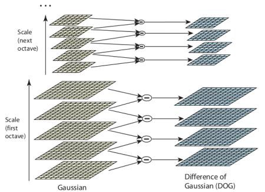
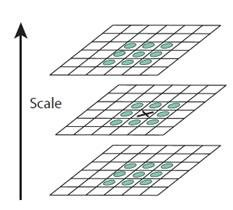
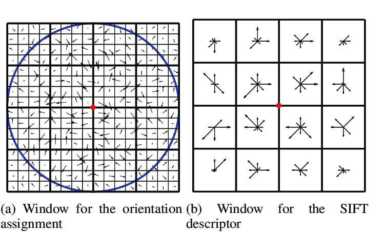
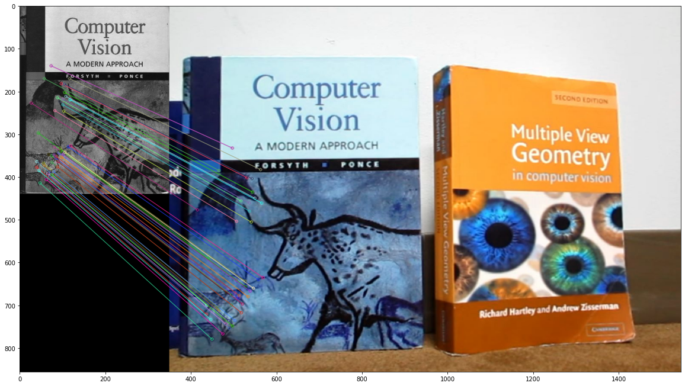

# Image Mosaics
## 1 - Getting Correspondences
#### Use SIFT descriptor
- Scale-space peak selection: Potential location for finding features.
---------

- Keypoint Localization: Accurately locating the feature keypoints.
---------

- Orientation Assignment: Assigning orientation to keypoints.
---------

- Keypoint descriptor: Describing the keypoints as a high dimensional vector.
---------

- Keypoint Matching
---------

### Matching Paramter 
- 2 KNN Matching
- Applied ratio 0.75
- 50 correspondences

## 2 - Homography Parameters
### 2D transformations in heterogeneous coordinates
#### Determining the homography matrix
##### $P^{`}$ = $H$ . $P$
$$ \begin{bmatrix}
x_{n}\\
y_{n}\\
1
\end{bmatrix} 
= \alpha
\begin{bmatrix}
h_{1} & h_{2} & h_{3} \\
h_{4} & h_{5} & h_{6}\\
h_{7} & h_{8} & h_{9}
\end{bmatrix}
\begin{bmatrix}
x_{}\\
y_{}\\
1
\end{bmatrix}
$$

### Solving for H using DLT
#### 1 - For each correspondence, create 2x9 matrix $A_{i}$
#### 2 - Concatenate into single 2n x 9 matrix $A$
#### 3 - Compute SVD of  $A = U \Sigma V^{T}$
#### 4 - Store singular vector of the smallest singular value $h_{i} = v_{\hat{i}}$
#### 5 - Reshape to get $H$

